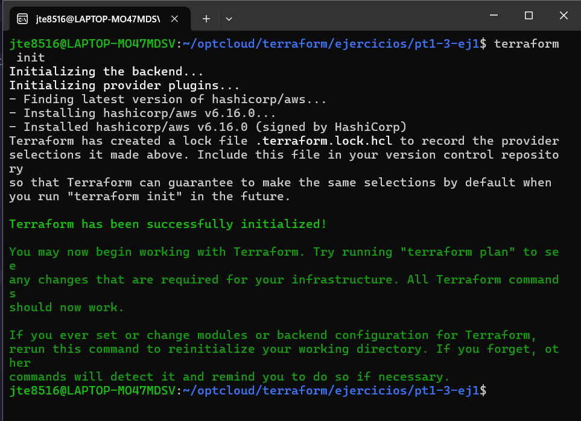
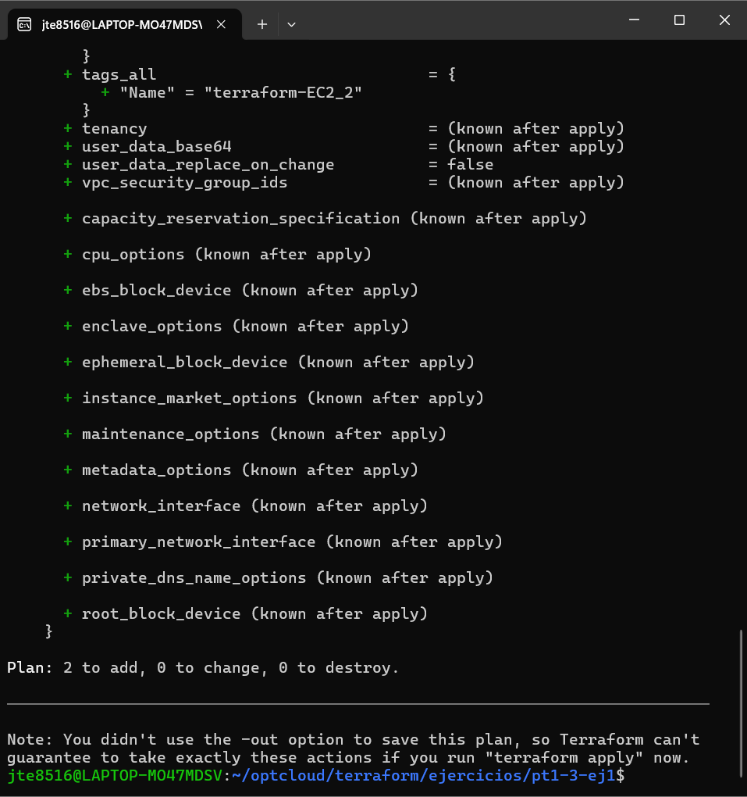
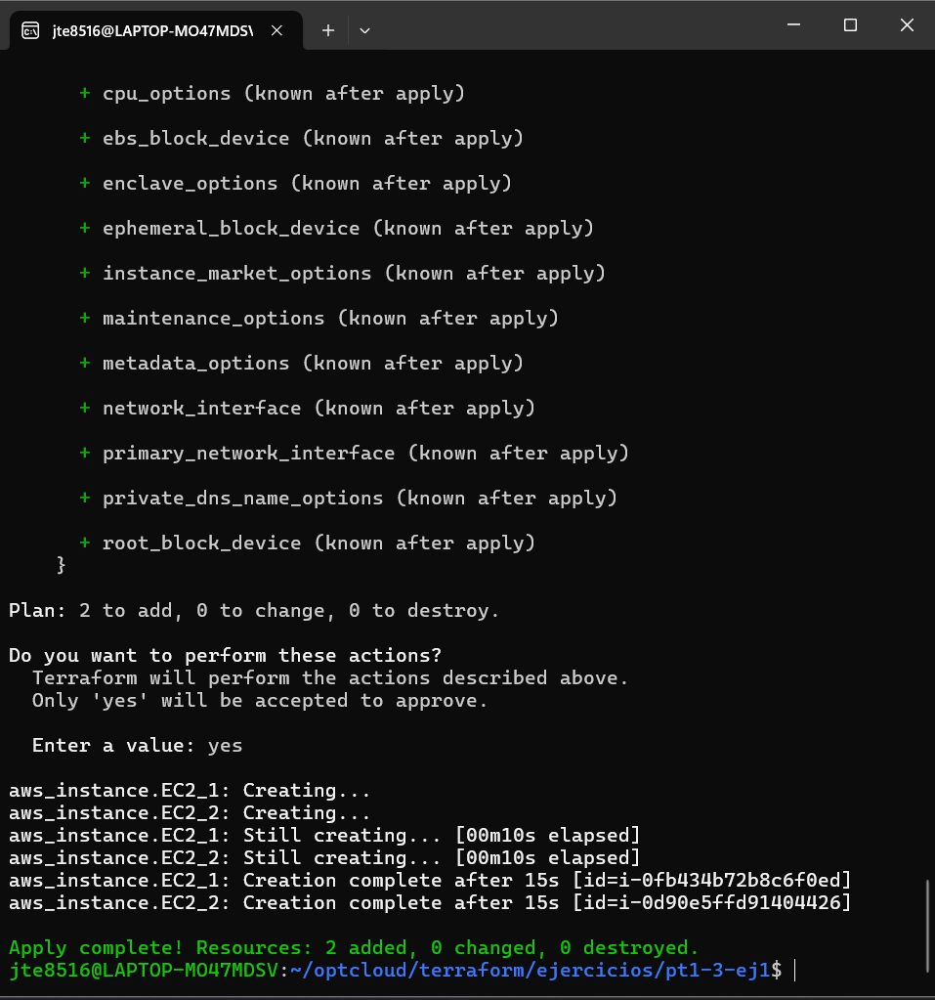

Ejercicio 1:

Primero creamos la ruta donde haremos el ejercicio
que en mi caso es en optcloud/terrform/ejercicios/pt1-3-ej1
Segundo crearemos las instancias en el visual studio code
Tercero entraremos en la ruta y ponemos los siguientes comandos 
terraform init
terraform plan
terraform apply
Y las instancias estaran añadidas

